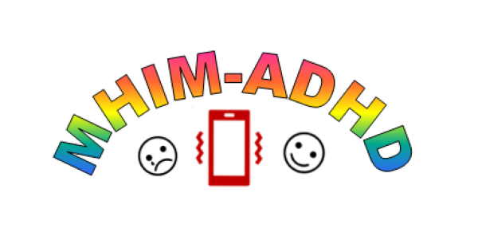

<h2 style="text-align: center;"><span style="color:black">*Understanding the daily life experiences of adolescents with ADHD*</span></h2>

```{r, echo = FALSE, fig.align = 'center'}
knitr::opts_chunk$set(echo = FALSE)

``` 

### What is MHIM-ADHD?

MHIM stands for ‘mental health in the moment’. MHIM-ADHD is a research project exploring the daily life experiences of adolescents with attention deficit hyperactivity disorder (ADHD). The project will explore many aspects of daily life including peer relations, managing emotions and mental health. On this website, you can find information on the study, and   how you can take part , including links to information sheets, consent forms and online surveys. We will also update the website with study <a href="https://mhim-adhd.github.io/Study/findings.html" style="color: blue;">findings</a>.


### So why are we doing this project?

Evidence suggests that peer difficulties and emotion regulation challenges contribute to co-occurring mental health issues for adolescents with ADHD. These might include  anxiety, depression, and behaviour problems. However, current interventions for emotion regulation and peer difficulties have been criticized for focusing on deficits and neglecting strengths, not reflecting real life contexts, and not being suitably adapted for adolescents.. This project, undertaken by a team at the University of Edinburgh led by  Aja Murray, uses online surveys and an ‘in-the-moment’ data gathering technique via a smartphone app to gain insights into the daily life experiences of adolescents with ADHD. Findings from the study can help to inform better interventions for adolescents with ADHD.

```{r, echo = FALSE, fig.align = 'center'}
knitr::opts_chunk$set(echo = FALSE)
knitr::include_graphics("friends.jpg")
``` 

### How can I take part?

If you are aged 12-14 with a diagnosis of ADHD you can take part in this study with a parent. Taking part involves filling in some questionnaires and completing very short surveys on a smartphone app. Please head to our study participant page for <a href="https://mhim-adhd.github.io/Study/info1.html" style="color: blue;">young people</a> and <a href="https://mhim-adhd.github.io/Study/info2.html" style="color: blue;">parents</a>.


```{r, echo = FALSE, fig.align = 'center'}
knitr::opts_chunk$set(echo = FALSE)
knitr::include_graphics("phone.jpg")
``` 

&nbsp;<br>

```{r, echo = FALSE, fig.align = 'center'}
knitr::opts_chunk$set(echo = FALSE)
knitr::include_graphics("uoe.png")
``` 


