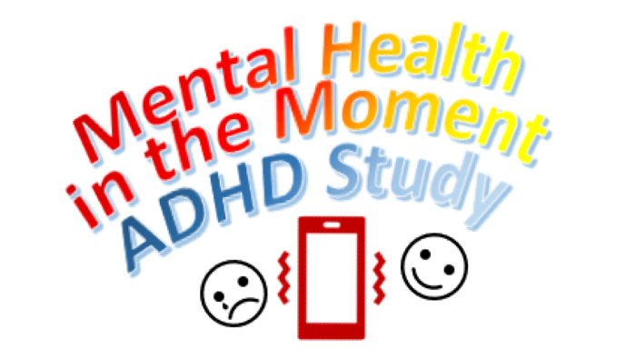

<h1 style="text-align: center;">*Illuminating the daily life experiences of adolescents with ADHD*</h1>

```{r, echo = FALSE, fig.align = 'center'}
knitr::opts_chunk$set(echo = FALSE)

``` 

We are conducting a research project exploring the daily life experiences of adolescents with ADHD. The project will explore many aspects of daily life including peer relations, managing emotions and mental health. On this website, we will proved some background information on the study, information on how you can participate in the study, including links to information sheets, consent forms and online surveys. Upon completion of this research project, you will also find a <a href="https://mhim-adhd.github.io/Study/findings.html" style="color: blue;">summary of our findings</a> on this website. 

Evidence suggests that peer difficulties and emotion regulation challenges contribute to co-occurring mental health issues for adolescents with ADHD, such as anxiety, depression, and behaviour problems. However, current interventions for emotion regulation and peer difficulties have been criticized for focusing on deficits, not reflecting real life contexts, nor focusing on adolescents. They also don’t focus enough on the strengths that adolescents with ADHD have. This research project, undertaken by a team at the University of Edinburgh led by Dr Aja Murray, uses online surveys and an ‘in-the-moment’ data gathering technique via a smartphone app to gain insights into the daily life experiences of adolescents with ADHD to help address this gap and pave the way for developing appropriate interventions. 

```{r, echo = FALSE, fig.align = 'center'}
knitr::opts_chunk$set(echo = FALSE)
knitr::include_graphics("friends.jpg")
``` 

For young people aged 12-14 with a diagnosis of ADHD and their parents interested in participating in our research study, which involves filling in some questionnaires and completing very short surveys on a smartphone app, please head to our study participant page for <a href="https://mhim-adhd.github.io/Study/info1.html" style="color: blue;">young people</a> or their <a href="https://mhim-adhd.github.io/Study/info2.html" style="color: blue;">parents</a>

As part of this research project, we are also recruiting advisory group members, that is parents of young people aged 12-14 with a diagnosis of ADHD as well as young people aged 12-14 with a diagnosis of ADHD. As a member of the advisory group, we will ask you to help us understand which factors you think are most important for improving the lives of young people with ADHD and that researchers should look into more. We are especially interested in how smartphones can be used to support adolescents with ADHD in regulating their emotions and enabling positive peer relationships.This will helps us design our research study so that we can gain opimal insights into how best to support adolescents with ADHD and their families. For more information on the advisory groups and on how to take part, see the information for the <a href="https://mhim-adhd.github.io/Study/advisory1.html" style="color: blue;">young people advisory group</a> or the information for the <a href="https://mhim-adhd.github.io/Study/advisory2.html" style="color: blue;">parent advisory group</a>.

```{r, echo = FALSE, fig.align = 'center'}
knitr::opts_chunk$set(echo = FALSE)
knitr::include_graphics("phone.jpg")
``` 

&nbsp;<br>

```{r, echo = FALSE, fig.align = 'center'}
knitr::opts_chunk$set(echo = FALSE)
knitr::include_graphics("uoe.png")
``` 


