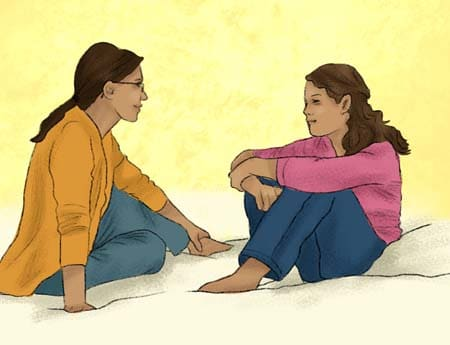

<h3 style="text-align: center;"><span style="color:darkblue">*Help us improve our understanding of how to support young people with ADHD and their families.*</span></h3> 
<h2 style="text-align: center;"><span style="color:black">If you are ready to start participating, please click this <a href="https://edinburgh.eu.qualtrics.com/jfe/form/SV_agdkr7R72tsPHcq" style="color: blue;">link.</a></span></h2> 
```{r, echo = FALSE, fig.align = 'center'}
knitr::opts_chunk$set(echo = FALSE)

``` 
### What is this study about?
We are inviting you and your child to take part in a research project exploring the experiences of young people with ADHD. The project will explore many aspects of daily life including friends, managing emotions and mental health. As part of this study, we will ask your child to do the following:

- Take part in an online survey that takes approximately 20 minutes, exploring friendships, relationships, emotions, and mental health.  

- Download a smartphone app and answer a few questions about your emotions and behaviours five times a day for two-weeks.

- At the end of the two-week period, complete another brief online survey taking less than 10 minutes. 

We will also ask you parents to fill in a questionnaire at the beginning and at the end of the study, each taking approximately 10-20 minutes.

### Who can take part in the study?
Young people **aged 12 to 14** with a **diagnosis of ADHD** and one of their parents/caregivers.

### Will my child need to own a smartphone?
If your child doesn't own a smartphone, we can provide them with one. Please get in touch via our email hotline [study email] to arrange this.

### Will my child be compensated?
Yes, your child will be compensated with a **shopping voucher** worth up to **£30**.

### How can my child and I take part in the study?
This <a href="https://edinburgh.eu.qualtrics.com/jfe/form/SV_agdkr7R72tsPHcq" style="color: blue;">link</a> will take you to an information page which gives you all the information you need before deciding whether you and your child would like to take part in the study. Before your child can start participating, you will need to sign a consent form to say that you are happy for them to participate. This form is at the end of the linked information page. Once you have completed the form you can start filling in the first questionnaire and you will receive further instructions on how your child can also start participating. Throughout the study, we will be offering video calls to help with any questions you and your child may have, for example relating to the completion of consent forms or the setting up of the smartphone app. You can also contact us via our email hotline [study email] at any time.

&nbsp;<br>

```{r, echo = FALSE, fig.align = 'center'}
knitr::opts_chunk$set(echo = FALSE)
knitr::include_graphics("uoe.png")
``` 
