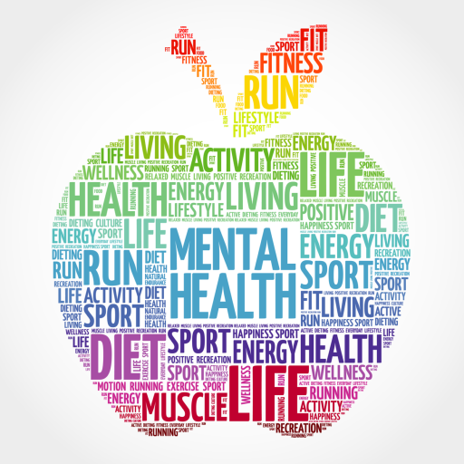

```{r, echo = FALSE, fig.align = 'center'}
knitr::opts_chunk$set(echo = FALSE)

```

<font size="4">If any of the topics discussed in the EMA study or advisory groups have caused you concern, we encourage you to talk to your **general practitioner** (GP) and a **trusted adult**. You can also contact one of the following mental health providers.</font>

### <a href="https://www.mind.org.uk" style="color: blue;">Mind</a> 

<a href="https://www.mind.org.uk" style="color: blue;">Mind</a> is a Mental Health charity that promotes positive wellbeing across the UK and campaign against stigma & discrimination faced by so many people experiencing mental Health challenges.

### <a href="https://www.youngminds.org.uk" style="color: blue;">Young Minds</a> 

<a href="https://www.youngminds.org.uk" style="color: blue;">Young Minds</a> is the UK's leading charity championing the wellbeing and mental health of children and young people. YoungMinds creates change so that children and young people can cope with life's adversities, find help when needed, and succeed in life.

### <a href="https://www.samaritans.org/?currency=EUR" style="color: blue;">Samaritans</a> 

Being a <a href="https://www.samaritans.org/?currency=EUR" style="color: blue;">Samaritan</a>  means being there for people who need someone to listen. They give people ways to cope and the skills to be there for others. They encourage, promote and celebrate those moments of connection between people that can save lives.

<span style="color:red">If you are having a mental health crisis, please call 111 and press option 2 for the First Response Service – a 24-hour service for people in mental health crisis.</span>

&nbsp;<br>

```{r, echo = FALSE, fig.align = 'center'}
knitr::opts_chunk$set(echo = FALSE)
knitr::include_graphics("uoe.png")
``` 
